# MyWarehouse

Welcome to the MyWarehouse project! This Android application is designed to streamline warehouse management by bridging the gap between warehouse workers and pickers. With robust features such as barcode scanning, map integration, camera and gallery access, Firebase integration, and real-time data synchronization, MyWarehouse is built to enhance efficiency and accuracy in warehouse operations.

## Features

### 🔍 Barcode Scanning
- **Barcode Scanning API:** Leverages advanced barcode scanning capabilities to allow users to quickly and accurately scan items within the warehouse. This feature ensures efficient tracking and management of inventory.

### 🗺️ Map Integration
- **Google Maps API Integration:** MyWarehouse includes detailed map functionality, allowing users to visualize warehouse layouts, item locations, and paths to specific items. The application supports custom map configurations with unique icons for a personalized and effective navigation experience.

### 📷 Camera and Gallery Access
- **Camera & Gallery Integration:** Users can take photos of items directly from the app or select images from their gallery. This feature helps in maintaining an up-to-date visual record of inventory items, aiding in quicker identification and quality checks.

### 🎨 Unique and Intuitive Design
- **Custom UI/UX:** MyWarehouse boasts a clean, modern design with a user-friendly interface. The application is designed with consistency in mind, utilizing Material Components for a cohesive look and feel across all screens. The design supports a modular structure with activity launchers for smooth transitions between activities.

### ☁️ Firebase Integration
- **Authentication:** Secure login and registration processes using Firebase Authentication.
- **Firestore:** Real-time data storage and synchronization of warehouse data, including items, orders, and logs.
- **Firebase Storage:** Efficient management of images and other media files uploaded by users.

### ⏱️ Real-Time Listeners and Caching
- **Real-Time Firebase Listeners:** The application uses real-time listeners to keep the data synchronized across all users. For example, order status updates and inventory changes are instantly reflected in the app.
- **Caching:** Data is cached where necessary to ensure a smooth user experience even when network connectivity is limited.

### 🧩 Activity Launcher API
- **Android Activity Launcher API:** MyWarehouse leverages the new Android Activity Launcher API for efficient and streamlined activity management. This API enhances the application's navigation, making it faster and more reliable.

## Screenshots

  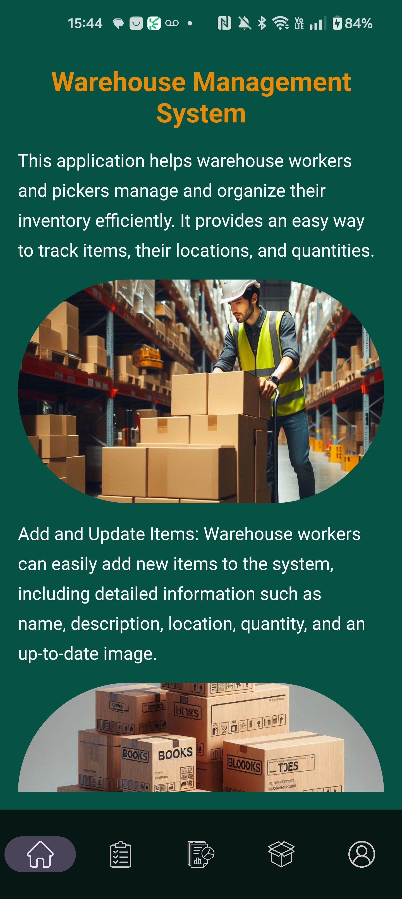
  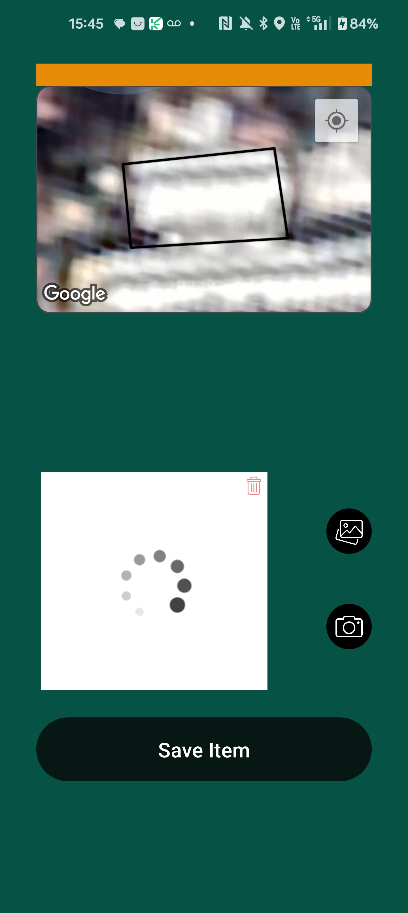
  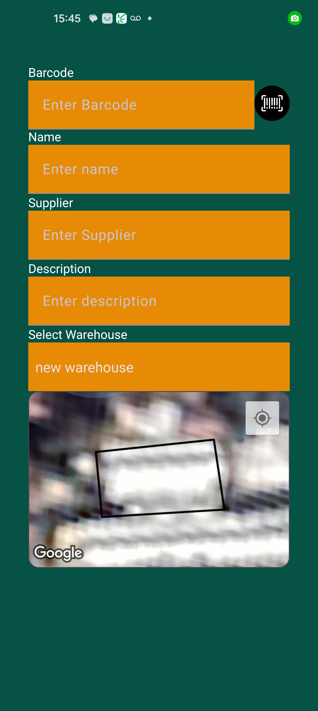
  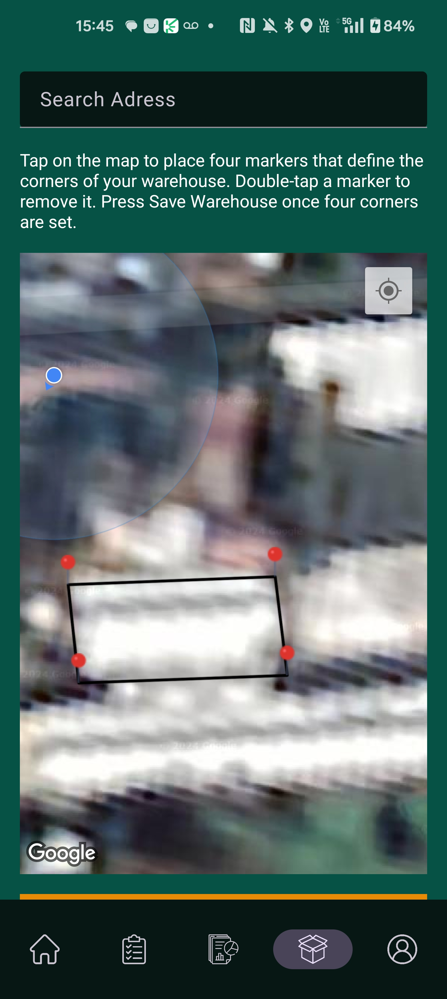

  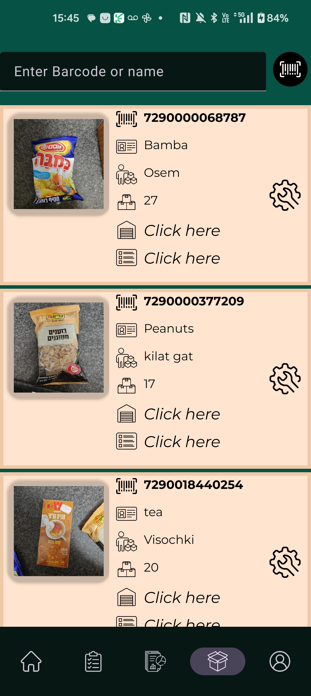
  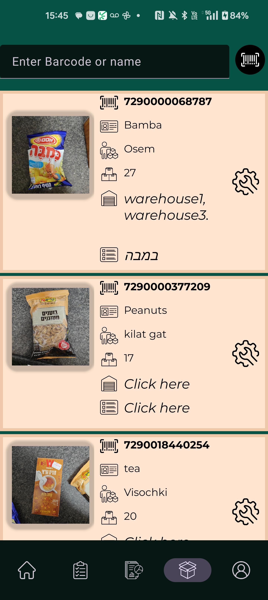
  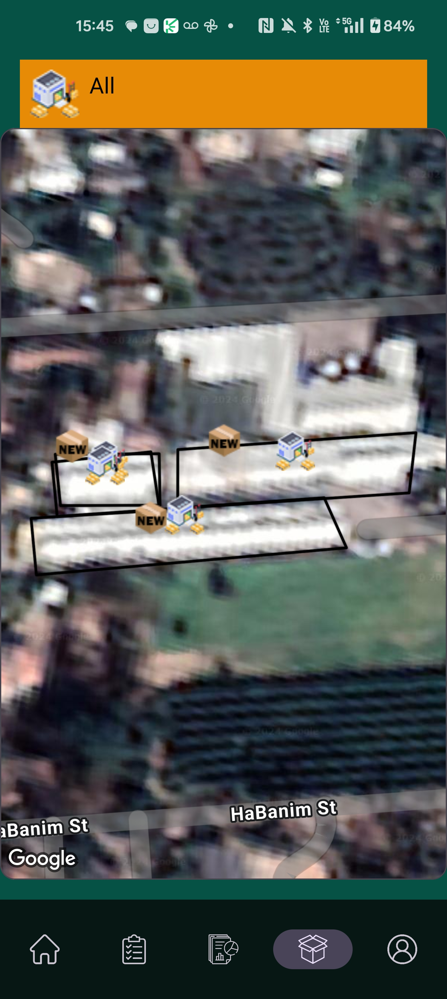
  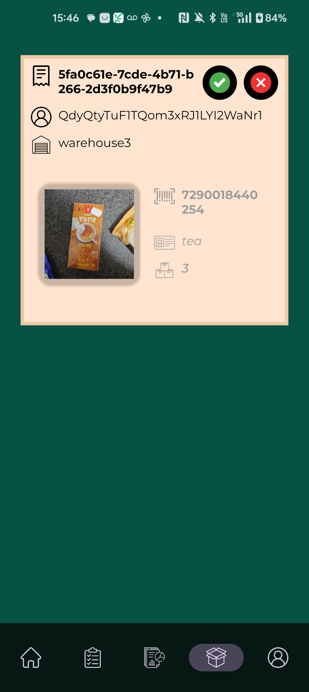

  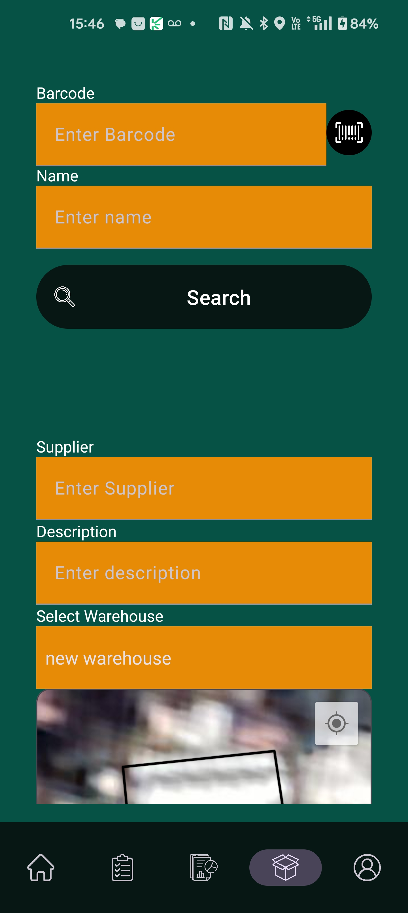
  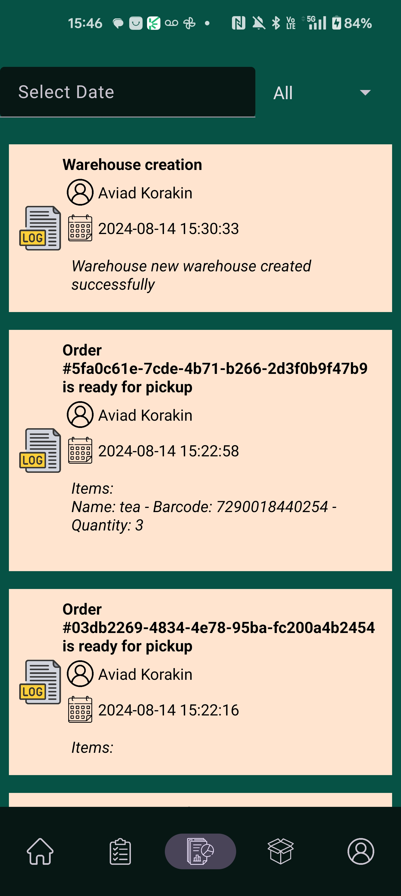
  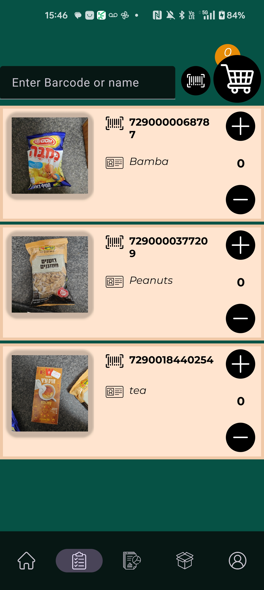
  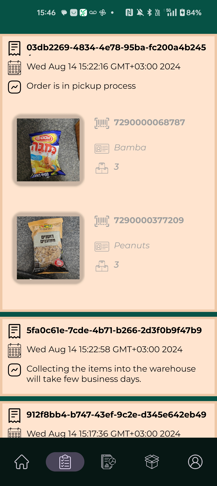

  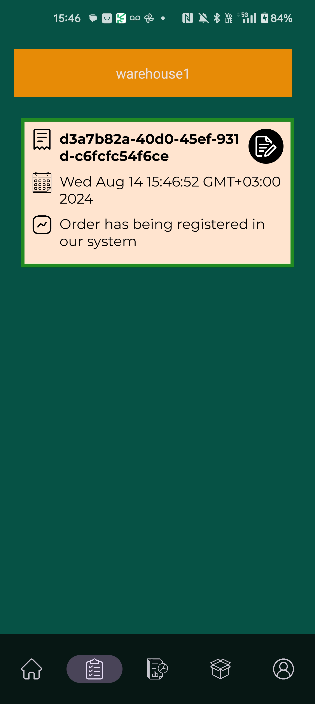
  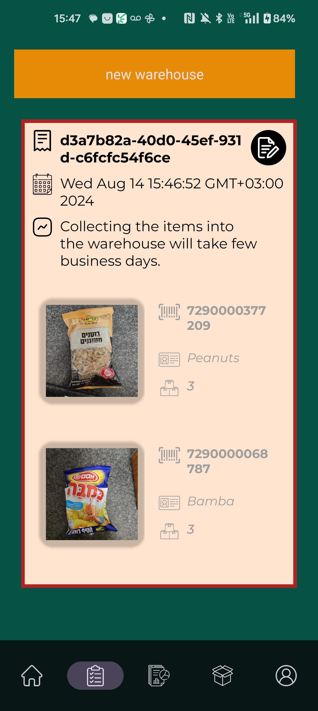
  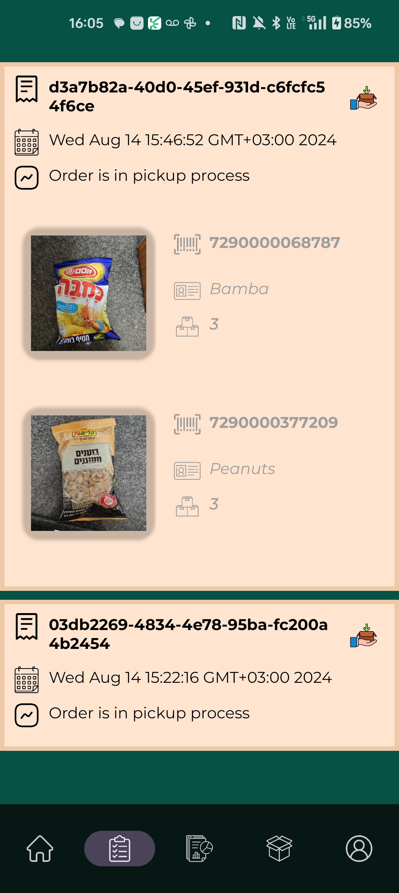
  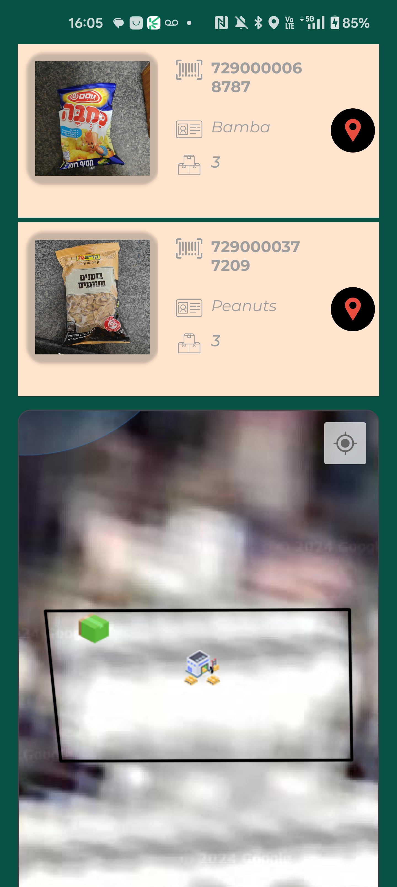

  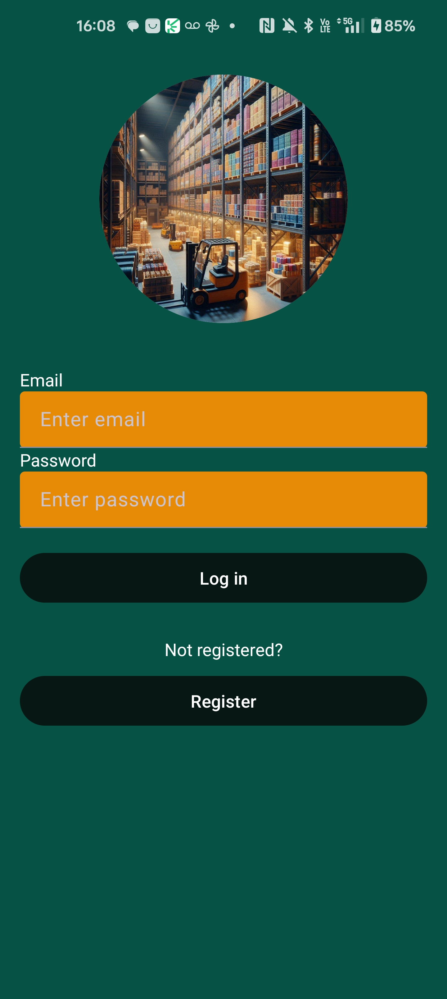
  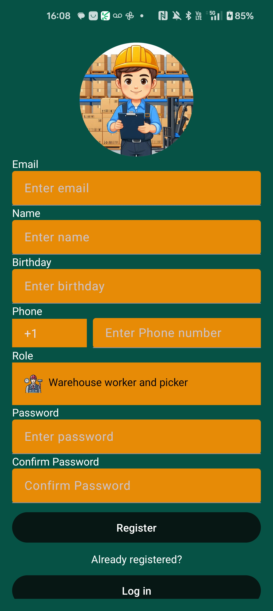

## Demo Video

## Contact

For any inquiries or feedback, feel free to reach out via [email](mailto:aviad825@gmail.com).
